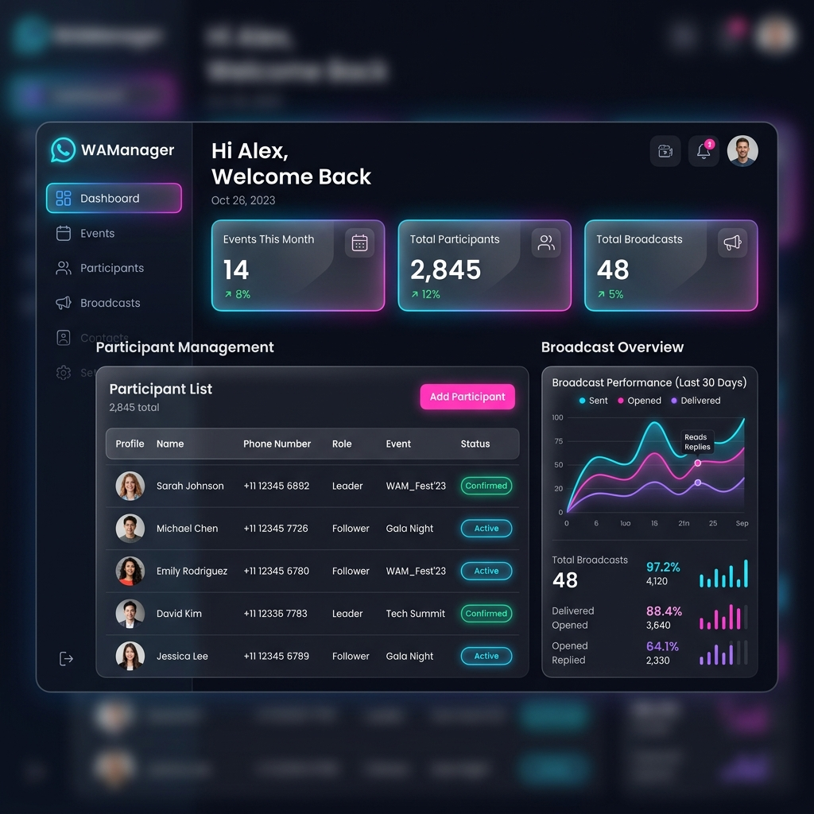

# 💬 WAManager - WhatsApp Event & Matchmaking Manager



Benvenuto in **WAManager**, una piattaforma web Premium sviluppata con **Django** e progettata per la gestione avanzata degli eventi, dei partecipanti e del matchmaking intelligente via **WhatsApp**.

Grazie a un'interfaccia utente elegante e moderna (basata su Glassmorphism) e all'integrazione fluida con le API di WhatsApp, WAManager permette di organizzare sondaggi, gestire le iscrizioni (Leader/Follower) e comunicare tempestivamente con tutti gli utenti.

---

## 🚀 Caratteristiche Principali

- **📊 Dashboard Premium**: Un'interfaccia utente accattivante (Glassmorphism) con statistiche in tempo reale e gestione semplificata.
- **👥 Gestione Partecipanti (Rubrica)**: Aggiungi, modifica o rimuovi i partecipanti assegnando ruoli specifici (es. *Leader*, *Follower*).
- **🤖 Integrazione WhatsApp (OpenWA)**: Invio e ricezione di messaggi in maniera automatizzata e affidabile.
- **⚡ Matchmaking Avanzato**: Bilanciamento automatico delle coppie basato sulle risposte e sui ruoli definiti.
- **🐳 Completamente Containerizzato**: Sviluppato e configurato per girare perfettamente tramite **Docker**.

---

## 🛠 Tecnologie Utilizzate

L'applicazione è basata su uno stack moderno, scalabile e sicuro:

- **Backend**: Python 3, [Django](https://www.djangoproject.com/) 5
- **Database**: [PostgreSQL](https://www.postgresql.org/) 15
- **Task Queue & Background Jobs**: [Django-Q2](https://django-q2.readthedocs.io/)
- **Integrazione WhatsApp**: [OpenWA](https://openwa.dev/)
- **Frontend**: HTML5, CSS3 (Vanilla Glassmorphism UI), JavaScript
- **DevOps**: [Docker](https://www.docker.com/), Docker Compose

---

## ⚙️ Installazione con Docker

Il metodo consigliato per eseguire WAManager è tramite Docker. L'ambiente include il database, il server web, il worker per i task asincroni e il gateway di WhatsApp.

### Prerequisiti
- [Docker](https://docs.docker.com/get-docker/) e [Docker Compose](https://docs.docker.com/compose/install/) installati sul tuo sistema.

### Passaggi per l'installazione

1. **Clona la repository** (se non l'hai già fatto):
   ```bash
   git clone <URL_DEL_TUO_REPO>
   cd WAManager
   ```

2. **Avvia i container**:
   Il file `docker-compose.yml` è già configurato. Avvia tutti i servizi in modalità detached:
   ```bash
   docker-compose up -d --build
   ```

3. **Inizializzazione del Database**:
   Al primo avvio, le migrazioni di Django verranno eseguite automaticamente. Se hai bisogno di creare un superutente per l'amministrazione nativa di Django:
   ```bash
   docker-compose exec web python manage.py createsuperuser
   ```

4. **Accedi all'applicazione**:
   - **Dashboard WAManager**: Apri il browser all'indirizzo [http://localhost:8000](http://localhost:8000)
   - **OpenWA Gateway**: Attivo in background e accessibile internamente. Se è richiesta l'autenticazione WhatsApp (scansione QR), controlla i log del container:
     ```bash
     docker-compose logs -f gateway
     ```

---

## 🛑 Comandi Utili (Docker)

- **Fermare tutti i container**:
  ```bash
  docker-compose down
  ```
- **Vedere i log in tempo reale**:
  ```bash
  docker-compose logs -f
  ```
- **Riavviare i worker (es. dopo aver cambiato codice per task in background)**:
  ```bash
  docker-compose restart worker
  ```

---

*Progetto sviluppato con passione. Per qualsiasi bug o richiesta di funzionalità, apri una Issue.*
